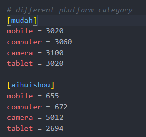
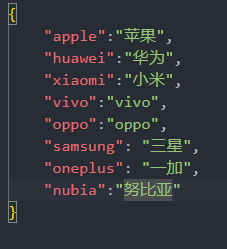

# Scrapy 功能文档
整个系统的核心功能，要如何返回给用户最好的结果？
1. 根据category爬取
2. 将description记录下来，放到Elastic Search，此时可以查询是否包含128gb类似的
3. 
---
# crawlerProcess.py


### "main" 主程序入口
**调用接口**：`python .\Product\crawlerProcess.py -a apple 苹果 -s mudah aihuishou`


### crawl_spider
**方法名称**： `crawl_spider`

**方法描述**：
1. 提供外部调用的主要接口
2. 该函数调用Scrapy的运行spider指令进行后台爬取并上传至ElasticSearch服务器
3. 爬取返回状态

**请求参数**： 
1. 有完整参数（正常爬取） - crawlerProcess.py -c mobile -b apple -m iphone 15 pro max -s mudah aihuishou -t 1
2. 无完整参数（对数据库增加数据，依据商品种类以及品牌） - crawlerProcess.py -c mobile -b apple -s mudah aihuishou -t 1

| 参数名    | 类型           | 必填 | 描述                                     |
| --------- | -------------- | ---- | ---------------------------------------- |
| category  | string         | 是   | 查询商品的种类                           |
| brandName | string         | 是   | 查询商品品牌（英文）                     |
| modelName | string         | 否   | 查询商品的型号                           |
| spiders   | list< string > | 是   | 爬取商品平台列表                         |
| isTest    | int            | 是   | 爬取商品是否为测试 1：为测试， 0：为正式 |
| iteration | int            | 否   | 爬取页面数量，不填为25                   |

*说明*
- 对于isTest参数，如果查询商品为测试，代表商品不存在于数据库中，所以爬取的商品可能为错误，需要标价该数据为测试。

爬虫程序会自行判断



**返回数据**
 | 类型           | 描述       |
 | -------------- | ---------- |
 | Boolean        | 成功与否   |

---

# ScrapyTermCompare.py
| 方法                               | 描述                                         |
| ---------------------------------- | -------------------------------------------- |
| private GetCategoryBrandModelsList | 获取当前爬取种类品牌底下的型号               |
| private GetOtherCategoryBrandDict  | 获取同样Models底下的SubModel，除了当前爬取的 |
| private GetListWordDict            | 获取型号的独特字符串                         |
| private CleanTitle                 | 对标题进行处理                               |
| public GetMostSimilarProduct       | 获取最相近的产品型号                         |
| private Levensthein                | 对标题与型号列表进行比较                     |


OtherCategoryBrandDict
```json
{
    "watch series 6" : "watches",
    "watch series 5" : "watches",
    "watch series 4" : "watches",
    "macbook air" : "computer",
    "macbook pro" : "computer",
    "mac mini" : "computer",

}
```