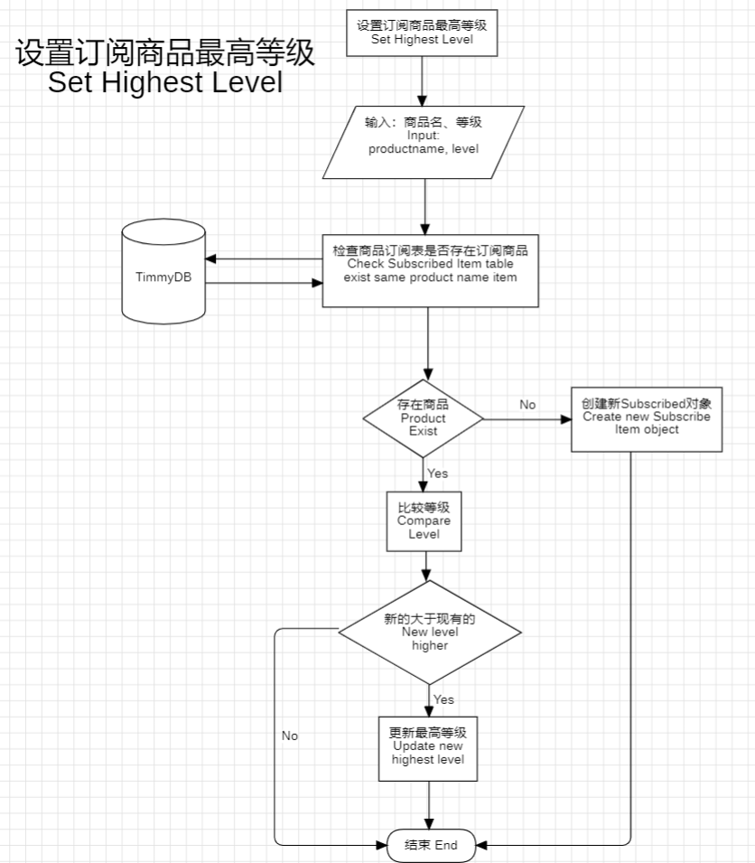
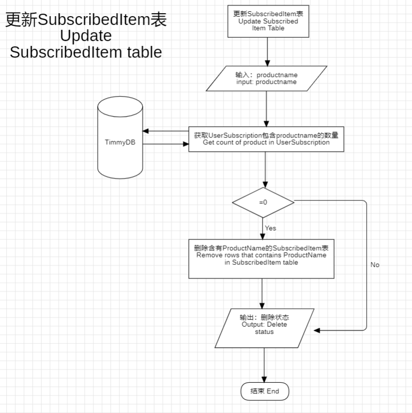

# Subscribed Item Service
| Method Name                                                     | Describe/描述                                                                     | Complete/完成情况 |
| --------------------------------------------------------------- | --------------------------------------------------------------------------------- | ----------------- |
| [GetHighestLevel](#get-highest-level)                           | Get highest level of specific product / 获取特定订阅物品的最高等级                | 完成              |
| [DropSubscribedItem](#drop-subscribed-item)                     | Drop specific subscribed product / 删除订阅物品                                   | 完成              |
| [SetHighestLevel](#set-highest-level)                           | Set new or same highest level / 更新商品最高订阅等级                              | 完成              |
| [UpdateRemoveSubscribedItem](#update-remove-subscribed-item)    | Update subscribed item (might delete or remain) / 更新订阅产品（可能删除或保留）  | 完成              |
| [GetSubscribedItemAboveLevel](#get-subscribed-item-above-level) | Get all subscribed item above specific level / 获取大于或等特定等级的所有订阅商品 | *未完成*          |
| [ExecuteAutoUpdate](#execute-auto-update)                       | Execute auto update subscribed item / 执行自动更新订阅商品                        | *未完成*          |
|                                                                 |                                                                                   |                   |

---
### Get Highest Level
**方法名称**： `GetHighestLevel`

**方法描述**：
1. 通过商品名称查看数据表SubscribedItem是否包含该商品
2. 若包含商品返回最高等级，否则返回 **-1**

**请求参数**： 
| 参数名      | 类型   | 必填 | 描述           |
| ----------- | ------ | ---- | -------------- |
| productName | string | 是   | 商品名称   |

**返回数据**
| 类型           | 描述             |
| -------------- | ---------------- |
| SubscribedItem | 最高商品订阅对象 |

---
### Drop Subscribed Item
**方法名称**： `DropSubscribedItem`

**方法描述**：
1. 通过商品名称查看数据表SubscribedItem是否包含该商品
2. 若有进行删除返回True,否则False

**请求参数**： 
| 参数名      | 类型   | 必填 | 描述           |
| ----------- | ------ | ---- | -------------- |
| productName | string | 是   | 商品名称   |

**返回数据**
| 类型    | 描述     |
| ------- | -------- |
| Boolean | 删除状态 |

---

### Set Highest Level

**方法名称**： `SetHighestLevel`

**方法描述**：
1. 调用查找最高等级进行比较
2. 若输入level大于数据库内，替换

**请求参数**： 
| 参数名      | 类型   | 必填 | 描述     |
| ----------- | ------ | ---- | -------- |
| productName | string | 是   | 商品名称 |
| level       | int    | 是   | 新商品等级 |

**返回数据**
| 类型           | 描述     |
| -------------- | -------- |
| SubscribedItem | 更新对象 |

---

### Update Remove Subscribed Item

**方法名称**： `UpdateRemoveSubscribedItem`

**方法描述**：
1. 查看ProductName是否存在与UserSubscription
   1. 存在：不删除
   2. 不存在：删除SubscribedItem表对象

**请求参数**： 
| 参数名      | 类型   | 必填 | 描述     |
| ----------- | ------ | ---- | -------- |
| productName | string | 是   | 商品名称 |

**返回数据**
| 类型    | 描述     |
| ------- | -------- |
| Boolean | 删除状态 True删除、False未删除 |

---

### Get Subscribed Item Above Level

**方法名称**： `GetSubscribedItemAboveLevel`

**方法描述**：
1. 获取少于等于输入等级的所有SubscribedItem列表
   1. 例如输入为1， 将获取highest_level为1，2，3的所有SubscribedItem
   2. 例如输入为3， 将获取highest_level >= 3的所有SubscribedItem 

**请求参数**： 
| 参数名 | 类型 | 必填 | 描述         |
| ------ | ---- | ---- | ------------ |
| level  | int  | 是   | 最高订阅等级 |

**返回数据**
| 类型                   | 描述                         |
| ---------------------- | ---------------------------- |
| List< SubscribedItem > | 所有符合标准的SubscribedItem |

**边缘条件**
1. 完全没有SubscribedItem

---

### Execute Auto Update

**方法名称**： `ExecuteAutoUpdate`

**方法描述**：
1. 

**请求参数**： 
| 参数名        | 类型 | 必填 | 描述                         |
| ------------- | ---- | ---- | ---------------------------- |
| scrapingLevel | int  | 是   | 需要爬取的订阅商品的最高等级 |

**返回数据**
| 类型    | 描述                           |
| ------- | ------------------------------ |
| Boolean | 爬取状态 True删除、False未删除 |

---