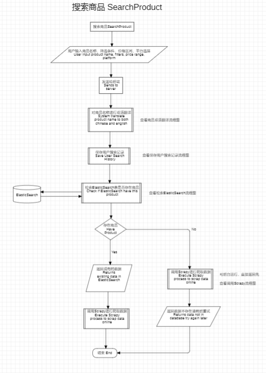
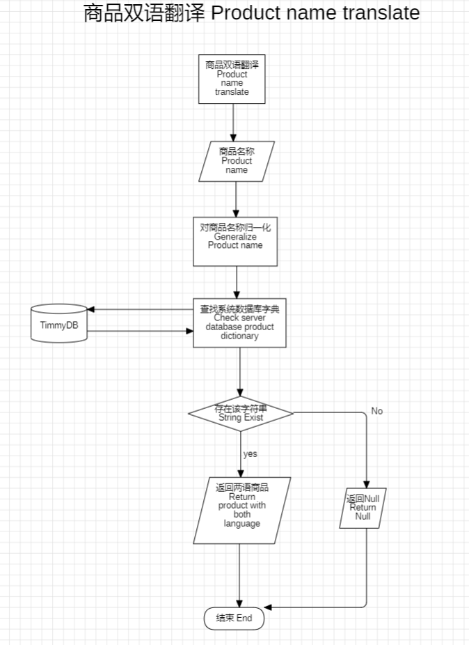
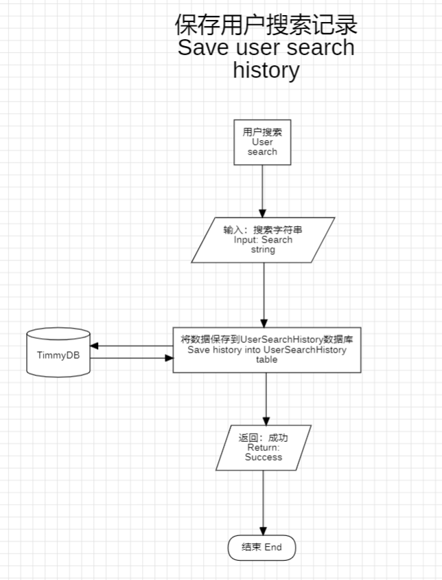
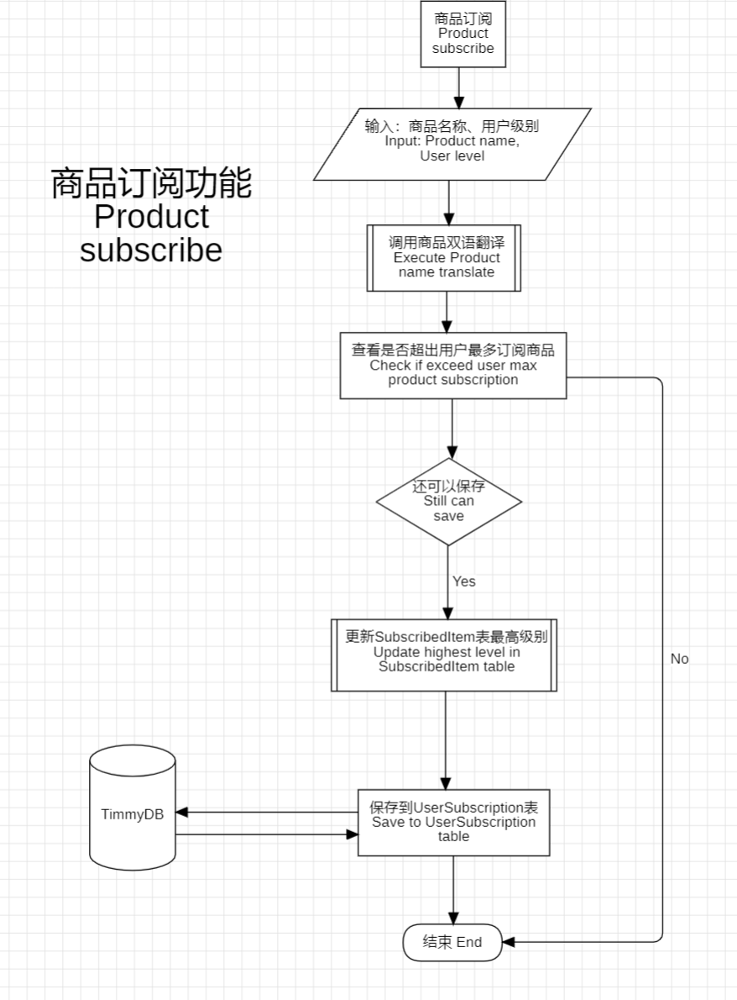
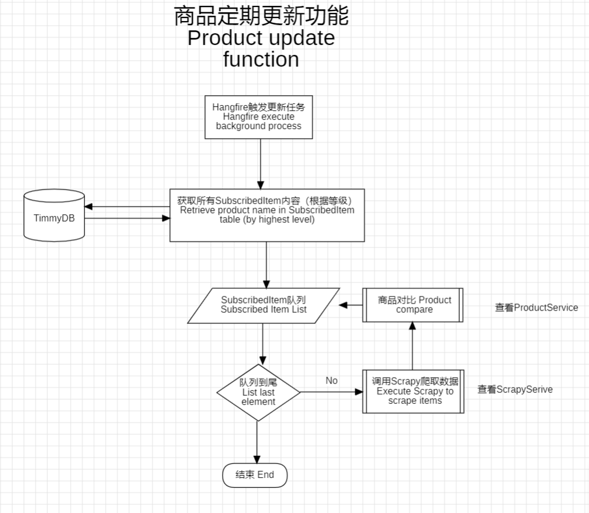
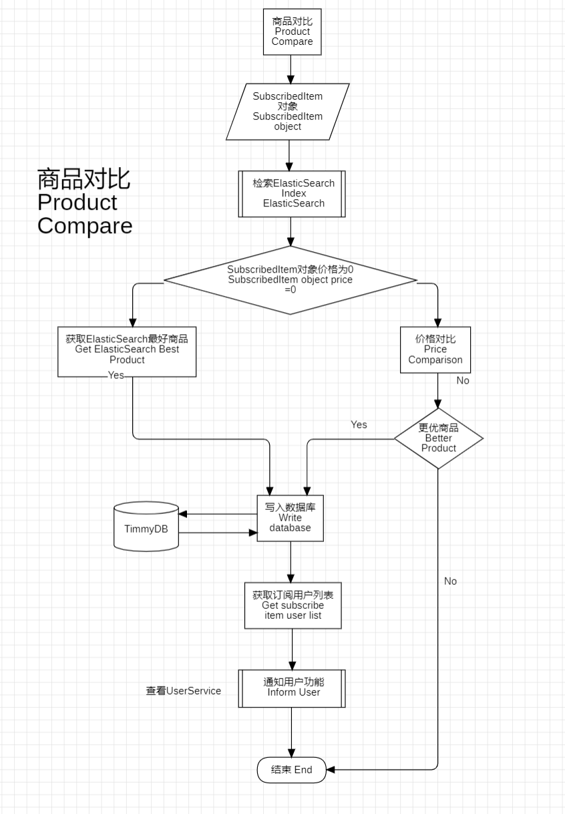
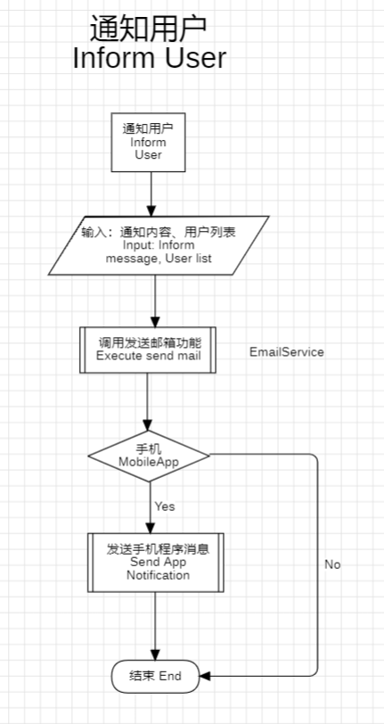
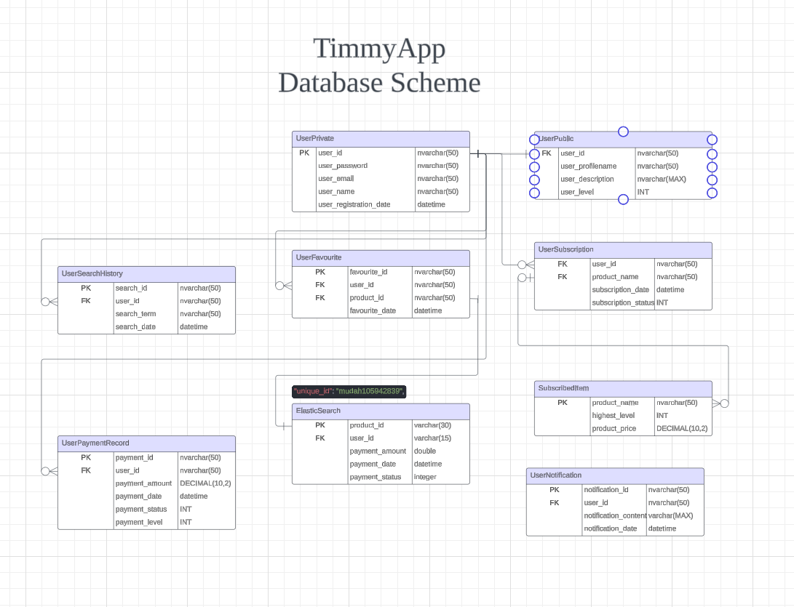

# 系统功能
---
## 商品查询组

### 商品查询功能（ProductAPI）

- 功能描述：用户可通过输入商品关键字进行搜索，系统返回数据库中存在的相关数据。若不存在，则提示用户商品尚未爬取，并建议用户稍后再试。
- 操作流程：
  - 用户点击搜索框，输入商品关键字。
  - 点击搜索按钮，系统执行查询操作。
  - 系统返回查询结果或提示信息
- 界面展示：
  - 搜索框及搜索按钮。
  - 查询结果列表或提示信息。
- 注意事项：
  - 提醒用户检查关键字的输入是否正确。
  - 确保系统能够正确处理特殊字符和空格。

### 搜索双语支持（例如iphone会自动翻译成苹果，samsung自动为三星）（ProductService）

- 功能描述：用户在进行商品搜索时，系统会自行对输入进行字典翻译，以得到更多信息。
- 操作流程：
  - 用户进行商品搜索。
  - 系统根据输入对其翻译发送给后端。
- 界面展示：
  - 显示翻译后的字符串。
- 注意事项：
  - 字典有限，通过人工录入，用户也可以自行提交正确的翻译。

###  调用Scrapy脚本（ScrapyService）（Hangfire后台进程运行）
- 功能描述：根据输入的商品名称在各个平台进行爬取并返回数据
- 注意事项：
  - 记录日志，记录更新了多少数据
  - new
  - update

### 商品筛选功能（前端实现）
- 功能描述：用户在进行商品搜索时，可根据价格区间和排序方式进行筛选。
- 操作流程：
  - 用户进行商品搜索。
  - 在搜索结果页面选择价格区间和排序方式。
  - 系统根据筛选条件更新搜索结果。
- 界面展示：
  - 价格区间选择框和排序方式选择项。
  - 筛选后的搜索结果列表。
- 注意事项：
  - 确保筛选条件能够准确反映用户需求。
  - 提供明确的筛选选项和标签，方便用户理解和操作。

### 用户搜索记录（UserAPI）

- 功能描述：用户在进行商品搜索时，会自动保存用户搜索记录。
- 操作流程：
  - 用户进行商品搜索。
  - 保存到数据库搜索记录表UserSearchHistory。
  - 用户点击个人搜索记录可查看记录。
- 界面展示：
  - 显示一系列的搜索记录（商品名称，搜索时间）。
- 注意事项：
  - 提供明确的入口，方便用户理解和操作。

---

### 商品订阅功能（ProductAPI）

- 功能描述：用户可订阅关键字，系统将在特定时间段爬取数据，并在找到符合用户需求的商品时即时通知用户。
- 操作流程：
  - 用户进入个人界面，选择订阅功能。
  - 输入订阅关键字，并选择定时程度。
  - 确认订阅设置，系统开始监控。
- 界面展示：
  - 订阅输入框及定时选择项。
  - 订阅确认按钮及订阅状态显示。
- 注意事项：
  - 提供价格或品质筛选条件，以便用户过滤不符合需求的商品。
  - 确保系统能够准确识别并通知用户符合条件的商品。

### 商品定期更新功能（ProductService - Hangfire后台进程运行）

- 功能描述：系统定时对数据进行爬取，更新ElasticSearch数据库，同时会进行**商品对比**。
- 注意事项：
  - 记录下来更新商品数量（SubscribedItem List）。

### 商品对比功能 （ProductService）

- 功能描述：根据价格比较查看是否有更低价格的商品，如果有进行数据库更新，并**通知用户**
- 注意事项：
  - 这一边的比较功能除了价格上的比较之后能够在新增对比指标（综合度等等、暂时完成简单的）

### 通知用户功能（UserService）

- 注意事项：
  - **手机端**
  - **电脑端**

---

### 商品收藏功能（ProductAPI）
- 功能描述：用户可以在商品界面收藏商品，以便后续查看。
- 操作流程：
  - 用户进入商品界面。
  - 点击收藏按钮进行收藏。
  - 用户可再次点击已收藏的按钮进行取消收藏。
- 界面展示：
  - 收藏按钮及收藏状态显示。
  - 用户收藏列表或收藏夹页面。
- 注意事项：
  - 确保收藏功能的稳定性和可靠性。
  - 提供收藏夹管理功能，方便用户查看和管理已收藏的商品。

### 用户升级功能
- 功能描述：用户可以通过付费方式进行服务升级。
- 操作流程：
  - 用户进入个人页面，点击升级等级功能。
  - 查看升级选项和价格，选择升级方案。
  - 进行付费操作，完成升级。
- 界面展示：
  - 升级选项和价格列表。
  - 付费按钮及支付状态显示。
- 注意事项：
  - 确保升级流程的简洁明了，方便用户操作。
  - 提供升级后的服务说明和权益保障，增强用户信任感。

---
## 用户基本操作组

### 用户登录（已完成）（UserAPI）
- 功能描述：用户可以通过输入正确的用户名和密码登录系统。
- 操作流程：
  - 用户打开系统登录页面。
  - 输入用户名和密码。
  - 点击登录按钮。
  - 系统验证用户名和密码是否匹配。
  - 如果匹配成功，用户成功登录系统，跳转到个人页面；否则，提示用户名或密码错误。
- 界面展示：
  - 用户名输入框
  - 密码输入框
  - 登录按钮
  - 错误信息提示（如果用户名或密码错误）
- 注意事项：
  - 提供友好的用户界面，方便用户输入用户名和密码。
  - 对用户输入的密码进行安全性验证，确保用户信息安全。
  - 在登录失败时清晰地告知用户错误的原因，以便用户进行后续操作。

### 用户登出 （UserAPI）
- 功能描述：用户可以安全退出系统。
- 操作流程：
  - 用户在个人页面或任意页面找到退出或注销按钮。
  - 点击退出或注销按钮。
  - 系统提示确认退出。
  - 确认退出后，系统执行登出操作，用户成功退出系统。
- 界面展示：
  - 退出或注销按钮
- 注意事项：
  - 提供明显的退出或注销按钮，方便用户找到并操作。
  - 在执行退出操作前，需提示用户确认，以防止误操作。

### 用户注册（已完成）（UserAPI）
- 功能描述：用户可以注册新账号，成为系统的注册用户。
- 操作流程：
  - 用户打开系统注册页面。
  - 输入所需的注册信息，包括用户名、密码、电子邮箱等。
  - 点击发送验证码
  - 输入验证码
  - 点击注册按钮。
  - 系统验证注册信息的有效性。
  - 如果验证通过，系统创建新账号，用户注册成功；否则，提示用户修改不合规的信息。
- 界面展示：
  - 用户名输入框
  - 密码输入框
  - 电子邮箱输入框
  - 验证码输入框
  - 注册按钮
  - 错误信息提示（如果注册信息不合规）
- 注意事项：
  - 不能有重复**username**和**email**
  - 在注册页面提供清晰的说明和提示，指导用户正确填写注册信息。
  - 对用户输入的注册信息进行有效性验证，确保注册信息的准确性和完整性。
  - 在注册失败时清晰地告知用户错误的原因，并指导用户如何解决问题。

---

# 系统权限与安全性
---
### 用户角色与权限
| 角色   | 权限                                 |
| ------ | ------------------------------------ |
| 管理者 | 拥有所有权限                         |
| 高级   | 拥有订阅无限商品以及时间间隔为每小时 |
| 中级   | 订阅5个商品以及时间间隔为半天        |
| 普通   | 订阅2个商品以及时间间隔为一天        |

### 安全性措施
- 用户密码：利用加密算法
- 用户验证：邮箱验证码

---
# 数据管理与存储
---
### 数据库设计

**一、概述**
本数据库设计文档旨在描述用户私有信息、用户公有信息、用户订阅、订阅商品、用户搜索历史和用户收藏等功能的数据库表结构。通过合理设计表结构和字段，实现用户信息的存储、查询和管理。

**二、表结构**

1. 用户私有信息表 UserPrivate
   - **user_id**：用户ID，主键，自增。
   - user_password：用户密码，加密存储。
   - user_email：用户邮箱，唯一索引。
   - user_name：用户名。
   - user_registration_date：用户注册日期，记录用户加入系统的时间。

2. 用户公有信息表 UserPublic    
   - *user_id*：用户ID，外键关联UserPrivate表
   - user_profilename：用户昵称或公开名称。
   - user_description：用户描述或简介。
   - user_level：用户等级或权限级别。

3. 用户订阅表 UserSubscription
   - *user_id*：用户ID，外键关联UserPrivate表。
   - *product_name*：订阅商品名称，外键关联SubscribedItem表。
   - subscription_date：用户订阅日期，记录用户开始订阅的时间。
   - subscription_status：订阅状态，如“活跃”、“已过期”、“已取消”等。

4. 订阅商品表 SubscribedItem
   - **product_name**：商品名称，主键。
   - highest_level：订阅该商品所需的最高等级或权限。
   - product_price：商品价格或订阅费用。

5. 用户搜索历史表 UserSearchHistory
   - **search_id**：搜索历史ID，主键，自增。
   - *user_id*：用户ID，外键关联UserPrivate表。
   - search_term：搜索关键词。
   - date：搜索日期和时间。

6. 用户收藏表 UserFavourite
   - **favourite_id**：收藏ID，主键，自增。
   - *user_id*：用户ID，外键关联UserPrivate表。
   - *product_id*：商品ID，外键关联其他商品表（*ElasticSearch*）。
   - date：搜索日期和时间。

7. 用户通知表 UserNotification
   - **notification_id**：通知ID，主键，自增。
   - *user_id*：用户ID，外键关联UserPrivate表。
   - notification_content：通知内容。
   - notification_date：通知发送日期和时间。

8. 用户支付记录表 UserPaymentRecord
   - **payment_id**：支付记录ID，主键，自增。
   - *user_id*：用户ID，外键关联UserPrivate表。
   - payment_amount：支付金额。
   - payment_date：支付日期和时间。
   - payment_status：支付状态，如“成功”、“失败”、“待处理”等。
   - payment_level: 支付等级， 如“高级”、“中级”

**三、索引与约束**
- 在每个表的主键字段上创建唯一索引，确保数据的唯一性。
- 在UserPrivate表的user_email字段上创建唯一索引，防止重复邮箱注册。
- 在UserSubscription和SubscribedItem表的product_name字段上创建外键约束，确保订阅关系的正确性。
- 在UserFavourite表的product_id字段上创建外键约束，关联具体的商品表（根据实际情况定义）。

**四、注意事项**
- 在实际应用中，用户密码应使用安全的加密方式（如哈希加盐）进行存储，以保护用户隐私。
- 根据业务需求，可以考虑添加其他字段或约束，以满足特定的功能要求。
- 在设计数据库时，还需考虑性能优化、数据备份与恢复、安全性等方面的因素。

**五、总结**
本数据库设计文档描述了用户私有信息、用户公有信息、用户订阅、订阅商品、用户搜索历史和用户收藏等功能的数据库表结构。通过合理的表结构和字段设计，可以实现对用户信息的有效存储、查询和管理，为系统的正常运行提供数据支持。在实际应用中，还需根据具体需求进行调整和优化。

### 数据备份与恢复
---
# 错误处理与日志记录
---
### 日志记录
说明系统如何记录用户操作、错误事件等信息。