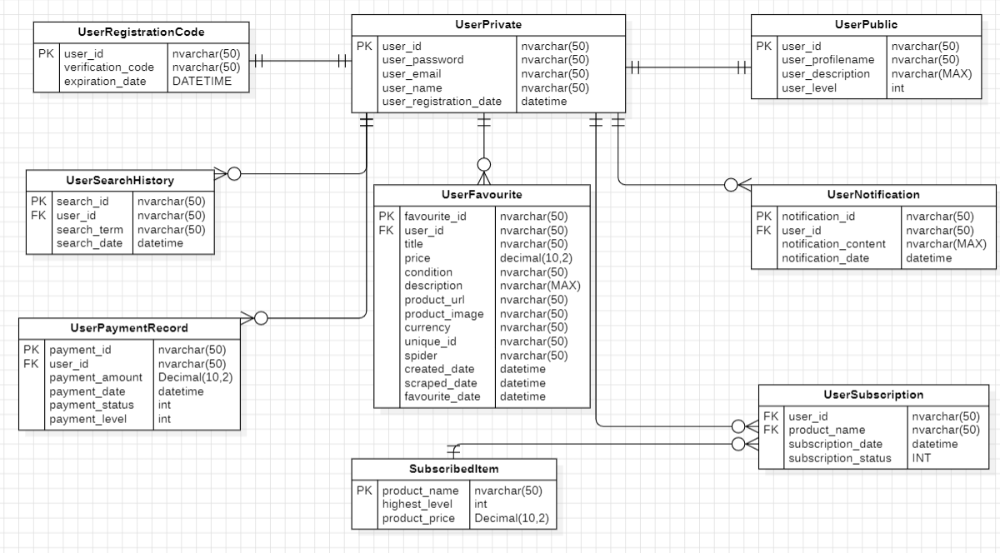

# 数据库设计

---

**[JsonIgnore]**

1. 连接数据库服务器，这里是本地的实例
```
sqlcmd -S (localdb)\localDB1
```

2. 创建数据库


```bash
-- 用户私有信息表 UserPrivate
CREATE TABLE UserPrivate (
    user_id NVARCHAR(50) PRIMARY KEY,
    user_password NVARCHAR(50),
    user_email NVARCHAR(50) UNIQUE,
    user_name NVARCHAR(50),
    user_registration_date DATETIME
);

-- 用户公有信息表 UserPublic
CREATE TABLE UserPublic (
    user_id NVARCHAR(50) PRIMARY KEY,
    user_profilename NVARCHAR(50),
    user_description NVARCHAR(MAX),
    user_level INT,
    CONSTRAINT FK_UserPublic_UserPrivate FOREIGN KEY (user_id) REFERENCES UserPrivate(user_id)
);


-- 订阅商品表 SubscribedItem
CREATE TABLE SubscribedItem (
    product_name NVARCHAR(50) PRIMARY KEY,
    highest_level INT,
    product_price DECIMAL(10,2)
);


-- 用户订阅表 UserSubscription
CREATE TABLE UserSubscription (
    user_id NVARCHAR(50) FOREIGN KEY REFERENCES UserPrivate(user_id),
    product_name NVARCHAR(50) FOREIGN KEY REFERENCES SubscribedItem(product_name),
    subscription_date DATETIME,
    subscription_status INT,
    CONSTRAINT PK_UserSubscription PRIMARY KEY (user_id, product_name),
    CONSTRAINT FK_UserSubscription_UserPrivate FOREIGN KEY (user_id) REFERENCES UserPrivate(user_id),
    CONSTRAINT FK_UserSubscription_SubscribedItem FOREIGN KEY (product_name) REFERENCES SubscribedItem(product_name)
);


-- 用户搜索历史表 UserSearchHistory
CREATE TABLE UserSearchHistory (
    search_id NVARCHAR(50) PRIMARY KEY,
    user_id NVARCHAR(50) FOREIGN KEY REFERENCES UserPrivate(user_id),
    search_term NVARCHAR(50),
    date DATETIME,
    CONSTRAINT FK_UserSearchHistory_UserPrivate FOREIGN KEY (user_id) REFERENCES UserPrivate(user_id)
);


-- 用户收藏表 UserFavourite
CREATE TABLE UserFavourite (
    favourite_id NVARCHAR(50) PRIMARY KEY,
    user_id NVARCHAR(50) FOREIGN KEY REFERENCES UserPrivate(user_id),
    title NVARCHAR(50),
    price DECIMAL(10,2),
    condition NVARCHAR(50),
    description NVARCHAR(MAX),
    product_url NVARCHAR(50),
    product_image NVARCHAR(50),
    currency NVARCHAR(50),
    unique_id NVARCHAR(50),        
    spider NVARCHAR(50), 
    created_date DATETIME,
    scraped_date DATETIME,
    favourite_date DATETIME,
    CONSTRAINT FK_UserFavourite_UserPrivate FOREIGN KEY (user_id) REFERENCES UserPrivate(user_id)
);


-- 用户通知表 UserNotification
CREATE TABLE UserNotification (
    notification_id NVARCHAR(50) PRIMARY KEY,
    user_id NVARCHAR(50) FOREIGN KEY REFERENCES UserPrivate(user_id),
    notification_content NVARCHAR(MAX),
    notification_date DATETIME
);
*/

-- 用户支付记录表 UserPaymentRecord
CREATE TABLE UserPaymentRecord (
    payment_id NVARCHAR(50) PRIMARY KEY,
    user_id NVARCHAR(50) FOREIGN KEY REFERENCES UserPrivate(user_id),
    payment_amount DECIMAL(10,2),
    payment_date DATETIME,
    payment_status INT,
    payment_level INT,
    CONSTRAINT FK_UserPaymentRecord_UserPrivate FOREIGN KEY (user_id) REFERENCES UserPrivate(user_id)
);

-- 用户验证码记录表 UserVerificationCode
CREATE TABLE UserVerificationCode(
	user_email NVARCHAR(50) PRIMARY KEY,
	verification_code NVARCHAR(50),
	expiration_date DATETIME,
) 

-- 每日搜索记录
CREATE TABLE DailySearch(
    product_name NVARCHAR(50) PRIMARY KEY
)

```

```
CREATE TABLE UserSubscriptionProduct(
    user_subscription_product_id NVARCHAR(50) PRIMARY KEY,
    user_subscription_id NVARCHAR(50),
    user_subscription_product_category NVARCHAR(50),
    user_subscription_product_brand NVARCHAR(50),
    user_subscription_product_model NVARCHAR(50),
    user_subscription_product_price DECIMAL(10,2),
    user_subscription_product_description NVARCHAR(50),
    user_subscription_product_condition NVARCHAR(50),
    user_subscription_product_country NVARCHAR(50),
    user_subscription_product_state NVARCHAR(50),
    user_subscription_product_spider NVARCHAR(50),
    user_subscription_product_currency NVARCHAR(50),
    user_subscription_product_added_date DATETIME,
    user_subscription_product_user_preference INT,
    user_subscription_product_url NVARCHAR(100),
    user_subscription_product_image NVARCHAR(100),
    user_subscription_product_unique_id NVARCHAR(100),
    CONSTRAINT FK_UserSubscriptionPro_UserSubscription_user_subscription_id FOREIGN KEY (user_subscription_id) REFERENCES UserSubscription(user_subscription_id)
        ON UPDATE CASCADE
        ON DELETE CASCADE
)
```

#  新版本 7/4/2024

```bash
-- 用户私有信息表 User
CREATE TABLE UserT(
    user_id NVARCHAR(50) PRIMARY KEY,
    user_name NVARCHAR(50) UNIQUE,
    user_email NVARCHAR(50) UNIQUE,
    user_password NVARCHAR(50),
    user_level INT,
    user_register_date DATETIME,
    user_phone_no NVARCHAR(50)
);

-- 用户收藏表 UserFavourite
CREATE TABLE UserFavourite (
    product_unique_id NVARCHAR(50),        
    user_id NVARCHAR(50),
    user_favourite_date DATETIME,
    PRIMARY KEY(user_id, product_unique_id),
    CONSTRAINT FK_UserFavourite_User_user_id FOREIGN KEY (user_id) REFERENCES UserT(user_id)
        ON UPDATE CASCADE
        ON DELETE CASCADE
);

-- 用户搜索历史表 UserSearchHistory
CREATE TABLE UserSearchHistory (
    user_search_history_product_full_name NVARCHAR(100),
    user_id NVARCHAR(50),
    user_searh_history_date DATETIME,
    PRIMARY KEY (user_id, user_search_history_product_full_name),
    CONSTRAINT FK_UserSearchHistory_User_user_id FOREIGN KEY (user_id) REFERENCES UserT(user_id)
        ON UPDATE CASCADE
        ON DELETE CASCADE
);

-- 用户验证码记录表 UserVerificationCode
CREATE TABLE UserVerificationCode(
	user_id NVARCHAR(50),
	user_email NVARCHAR(50) PRIMARY KEY,
	verification_code NVARCHAR(4),
	verification_code_expiration_date DATETIME,
    CONSTRAINT FK_UserVerificationCode_User_user_id FOREIGN KEY (user_id) REFERENCES UserT(user_id)
        ON UPDATE CASCADE
        ON DELETE CASCADE
) 

-- 用户通知表 Notification
CREATE TABLE Notification (
    notification_id NVARCHAR(50) PRIMARY KEY,
    user_id NVARCHAR(50),
    notification_title NVARCHAR(50),
    notification_content NVARCHAR(MAX),
    notification_type NVARCHAR(50),
    notification_date DATETIME,
    CONSTRAINT FK_Notification_User_user_id FOREIGN KEY (user_id) REFERENCES UserT(user_id)
        ON UPDATE CASCADE
        ON DELETE CASCADE
);

-- 管理员私有信息表 Administrator
CREATE TABLE Administrator (
    administrator_id NVARCHAR(50) PRIMARY KEY,
    administrator_name NVARCHAR(50) UNIQUE,
    administrator_email NVARCHAR(50) UNIQUE,
    administrator_password NVARCHAR(50),
    administrator_level INT,
    administrator_register_date DATETIME,
    administrator_phone_no NVARCHAR(50)
);

-- 每日搜索记录
CREATE TABLE DailySearch(
    product_name NVARCHAR(50) PRIMARY KEY
)

-- 订阅商品表 SubscribedProduct
CREATE TABLE SubscribedProduct (
    subscribed_product_full_name NVARCHAR(100) PRIMARY KEY,
    subscribed_product_category NVARCHAR(50),
    subscribed_product_brand NVARCHAR(50),
    subscribed_product_model NVARCHAR(50),
    subscribed_product_highest_level INT,
    subscribed_product_count INT
);

-- TimmyProduct
CREATE TABLE TimmyProduct (
    timmy_product_full_name NVARCHAR(100) PRIMARY KEY,
    timmy_product_category NVARCHAR(50),
    timmy_product_brand NVARCHAR(50),
    timmy_product_model NVARCHAR(50),
    timmy_product_sub_model NVARCHAR(50),
    timmy_product_adopted INT
)

-- 爬虫表 Scraper
CREATE TABLE Scraper (
    scrape_id NVARCHAR(50) PRIMARY KEY,
    scrape_time DATETIME,
    scrape_product_count INT,
    scrape_product_category NVARCHAR(50),
    scrape_product_brand NVARCHAR(50),
    scrape_product_model NVARCHAR(50),
    scrape_product_is_test INT,
    scrape_product_iteration INT
);

-- 用户订阅表 UserSubscription
CREATE TABLE UserSubscription (
    user_subscription_id NVARCHAR(50) PRIMARY KEY,
    user_subscription_product_full_name NVARCHAR(100),
    user_id NVARCHAR(50),
    user_subscription_product_category NVARCHAR(50),
    user_subscription_product_brand NVARCHAR(50),
    user_subscription_product_model NVARCHAR(50),
    user_subscription_product_sub_model NVARCHAR(50),
    user_subscription_product_description NVARCHAR(100),
    user_subscription_product_highest_price DECIMAL(10,2),
    user_subscription_product_lowest_price DECIMAL(10,2),
    user_subscription_product_country NVARCHAR(50),
    user_subscription_product_state NVARCHAR(50),
    user_subscription_product_condition NVARCHAR(50),
    user_subscription_notification_method NVARCHAR(50),
    user_subscription_notification_time INT,
    user_subscription_date DATETIME,
    user_subscription_price DECIMAL(10,2),
    user_subscription_status INT,
    user_subscription_spiders NVARCHAR(100),
    CONSTRAINT FK_UserSubscription_User_user_id FOREIGN KEY (user_id) REFERENCES UserT(user_id)
        ON UPDATE CASCADE
        ON DELETE CASCADE
);

-- 用户订阅商品表 UserSubscriptionProduct
CREATE TABLE UserSubscriptionProduct (
    user_subscription_product_id NVARCHAR(50) PRIMARY KEY,
    user_subscription_id NVARCHAR(50),
    user_subscription_product_currency NVARCHAR(50),
    user_subscription_product_added_date DATETIME,
    user_subscription_product_user_preference INT,
    user_subscription_product_url NVARCHAR(300),
    user_subscription_product_image NVARCHAR(300),
    user_subscription_product_unique_id NVARCHAR(100),
    user_subscription_product_title NVARCHAR(100),
    user_subscription_product_description NVARCHAR(MAX),
    user_subscription_product_condition NVARCHAR(50),
    user_subscription_product_spider NVARCHAR(50),
    user_subscription_product_price DECIMAL(10,2),
    user_subscription_product_price_CNY DECIMAL(10,2),
    CONSTRAINT FK_UserSubscriptionProduct_UserSubscription_id FOREIGN KEY (user_subscription_id) REFERENCES UserSubscription(user_subscription_id)
        ON UPDATE CASCADE
        ON DELETE CASCADE
);

-- 商品历史价格 PriceHistory
CREATE TABLE PriceHistory (
    price_history_id NVARCHAR(50) PRIMARY KEY,
    timmy_product_full_name NVARCHAR(100),
    price_history_price DECIMAL(10,2),
    price_history_effective_date DATETIME,
    price_history_spider NVARCHAR(50),
    CONSTRAINT FK_PriceHistory_TimmyProduct_timmy FOREIGN KEY (timmy_product_full_name) REFERENCES TimmyProduct(timmy_product_full_name)
        ON UPDATE CASCADE
        ON DELETE CASCADE
);

CREATE TABLE TimmyProductBase (
    timmy_product_base_id NVARCHAR(50) PRIMARY KEY,
    timmy_product_category NVARCHAR(50),
    timmy_product_brand NVARCHAR(50)
)

CREATE TABLE TimmyProductModel (
    timmy_product_model_id NVARCHAR(50) PRIMARY KEY,
    timmy_product_base_id NVARCHAR(50),
    timmy_product_model_model NVARCHAR(50),
    timmy_product_model_sub_model NVARCHAR(50),
    timmy_product_model_adopted NVARCHAR(50),
    CONSTRAINT FK_TimmyProductModel_TimmyProductBase_base_id FOREIGN KEY (timmy_product_base_id) REFERENCES TimmyProductBase(timmy_product_base_id)
        ON UPDATE CASCADE
        ON DELETE CASCADE 
)

---


TimmyDBV2

```

---
# 测试数据
```
-- 插入固定的产品分类数据，将sub_model设置为与brand相同
INSERT INTO TimmyProduct (timmy_product_full_name, timmy_product_category, timmy_product_brand, timmy_product_model, timmy_product_sub_model, timmy_product_adopted)
VALUES
    ('mobile apple iphone 13 pro', 'mobile', 'apple', 'iphone 13 pro', 'apple', 1),
    ('mobile asus rog', 'mobile', 'asus', 'rog', 'asus', 1),
    ('mobile samsung galaxy s21', 'mobile', 'samsung', 'galaxy s21', 'samsung', 1),
    ('camera nikon d3500', 'camera', 'nikon', 'd3500', 'nikon', 1),
    ('camera canon eos 5d mark iv', 'camera', 'canon', 'eos 5d mark iv', 'canon', 1),
    -- 添加更多数据
    ('mobile apple iphone 12', 'mobile', 'apple', 'iphone 12', 'apple', 1),
    ('mobile samsung galaxy note 20', 'mobile', 'samsung', 'galaxy note 20', 'samsung', 1),
    ('mobile asus zenfone 8', 'mobile', 'asus', 'zenfone 8', 'asus', 1),
    ('camera nikon z7 ii', 'camera', 'nikon', 'z7 ii', 'nikon', 1),
    ('camera canon eos r5', 'camera', 'canon', 'eos r5', 'canon', 1),
    -- 继续添加更多数据，总共添加20个
    ('mobile apple iphone se', 'mobile', 'apple', 'iphone se', 'apple', 1),
    ('mobile samsung galaxy a52', 'mobile', 'samsung', 'galaxy a52', 'samsung', 1),
    ('mobile asus rog phone 5', 'mobile', 'asus', 'rog phone 5', 'asus', 1),
    ('camera nikon d780', 'camera', 'nikon', 'd780', 'nikon', 1),
    ('camera canon eos 6d mark ii', 'camera', 'canon', 'eos 6d mark ii', 'canon', 1);

```

---
# 对于数据库的疑问

1. **是否已经考虑了对数据进行更新和删除操作时的级联效应？** 比如，当删除用户时，相关的订阅信息、搜索历史、收藏和支付记录是否也应该被相应地删除或标记为无效？
   1. 可以让用户选择是否保留数据，当系统删除的时候只是将UserPublic信息删除，让其他用户找不到她。

# 2 将Model移动进入C#
```cmd
dotnet ef dbcontext scaffold "Data Source=(localdb)\localDB1;Initial Catalog=TimmyDB;Integrated Security=True" Microsoft.EntityFrameworkCore.SqlServer --output-dir Models --context TimmyDbContext --no-build -f --
```

```cmd
dotnet ef dbcontext scaffold "Data Source=(localdb)\localDB1;Initial Catalog=TimmyDBV2;Integrated Security=True" Microsoft.EntityFrameworkCore.SqlServer --output-dir Models --context TimmyDbContext --no-build -f --data-annotations
```