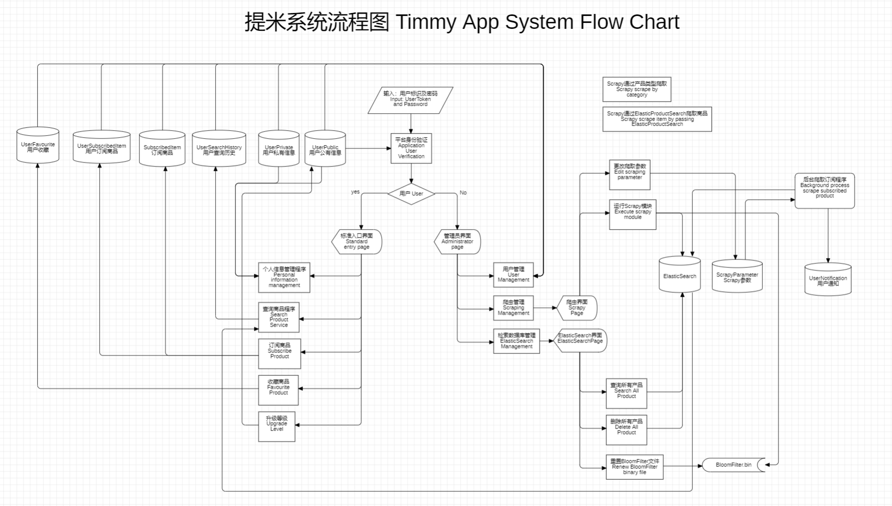
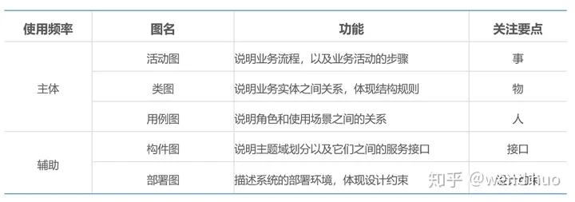
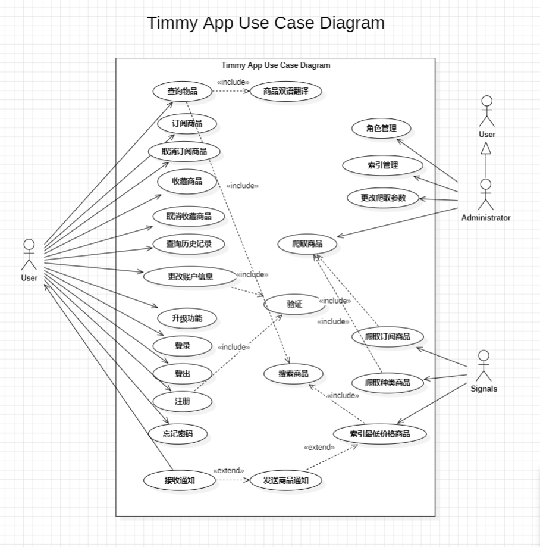
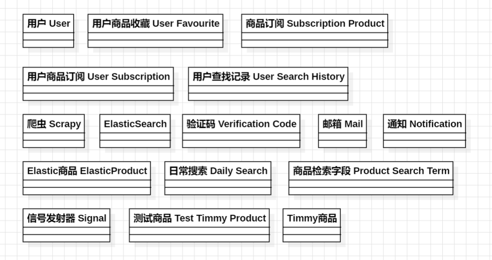

# 软件需求（包括问题定义、可行性分析、需求分析）

> - 确定系统必须完成的任务
> - 用户操作流程顺序
> - 系统约束条件
---

## 问题定义
*想象这是客户提出的要求*
2024/3/28
**一、** 现在为了解决网上二手商品太多平台导致搜索困难的起因下，要设计出一个系统能够从多个平台爬取数据并比价**获取价格更为低**的商品返回给用户。
**二、** 同时，返回的数据必须是**符合用户提出的（重点实现）**，比如说用户查询`iphone 15 pro max 512G`，系统应该返回手机而不是手机壳，这方面必须通过一些方法来解决。
**三、** 除此之外，该系统也应该让用户能够通过**商品类别进行查询**，避免查询错误的商品。
**四、** 并且为了**让用户第一时间获取最新消息**，需要采取更优秀的方式通知用户（如短信发送）。
**五、** 系统**事先爬取网站的部分信息**、保证能够及时返回数据
**六、** 系统用户应该分为**用户**和**管理员**，其中用户等级决定了用户可订阅的商品以及他们的推送频率。随后管理员有权利进行**用户管理**（查看用户的公有信息、订阅商品、游览记录、商品收藏），除此之外管理员也能**爬虫管理**（手动控制爬虫的使用），避免某网站的内部结构更改后造成系统崩溃，以及**检索数据库管理**（可手动删除检索数据库里面的所有数据等等）

2024/3/31
**七、** 用户再没法选择对应商品的时候可以进行一个测试检索，爬取的物品会进行标注为测试，并将该测试的搜索商品保存到一旁，管理员可以人工验证是否存在该类商品，并日后添加进入数据库内。

| 用户等级        | 特权                                           |
| --------------- | ---------------------------------------------- |
| 1 Normal        | 可同时订阅2个商品，并且每1天对订阅商品进行爬取 |
| 2 Advance       | 4个， 每12小时                                 |
| 3 Elite         | 6个，每6小时                                   |
| 4 Administrator | 无限制                                         |

## 可行性分析
*技术可行性*
| 模块         | 可行性 | 解释                                                                                                                                   |
| ------------ | ------ | -------------------------------------------------------------------------------------------------------------------------------------- |
| 爬虫模块     | 可     | 获取数据可以利用Scrapy框架，他大大的降低了爬取的难度，并且页提供了写入数据库以及数据清理的过程，可以再这个模块内对商品进行相应的过滤。 |
| 数据检索模块 | 可     | 利用ElasticSearch框架可大大的降低数据检索的开发过程，并且能够在检索文本类型快速返回适配度高的产品                                      |
| 服务器模块   | 可     | 利用 ASP.net core搭建后端服务器，并且集成EFCore进行数据库操作，除此之外，再利用hangfire调用后台程序进行爬虫模块的运行                  |
| 前端模块     | 可     | 技术上使用Vue.js框架可以快速搭建前端界面                                                                                               |

*系统流程图*

## 需求分析 Requirement Analysis（需求获取、需求分析、需求验证**循环**）
- 定义软件的适用领域和必须满足的约束
- 确定系统功能、性能、领域
- 确定软件与其他部分的接口和同行
- 建立数据模型、功能模型和行为模型（可使用用例图、类-对象图建模）
- 完成需求规格说明
(用例图、对象-类图)

### 获取需求
跳过此环节，因为需求人是自己

### 功能需求

| 需求分类           | 具体需求描述                                                                                                                                                                                                                                                       |
| ------------------ | ------------------------------------------------------------------------------------------------------------------------------------------------------------------------------------------------------------------------------------------------------------------ |
| 用户相关需求       | - 用户分为3个等级，每个等级有不同的订阅策略。 - 登录、注册（邮箱验证）、登出、忘记密码 - 查询、收藏、订阅。 - 更改个人信息、升级、查看历史记录（搜索、游览）                                                                                              |
| 管理员相关需求     | - 可查看所有用户信息（角色管理）  - 具有手动爬取商品操作。 - 具有更改爬取参数的操作   - 具有操控Elasticsearch内数据的权利                                                                                                                                 |
| 数据爬取和处理需求 | - Scrapy模块确保爬取的商品数据的正确性和准确性。 - 爬取的商品应根据种类进行分类。 - 系统进行商品比价，并通知用户（通过邮箱、手机推送、信息）。 - 系统在特定时间点爬取商品。 - 数据来源应该从多方面进行获取，以方便进行比较，分别给出每个平台的最优商品 |
| 系统模块划分需求   | - 系统分为四个模块：前端、Web服务器、Elasticsearch和Scrapy模块。                                                                                                                                                                                                   |
| 非功能性需求       | - 系统必须保证对爬取的商品数据的正确性和准确性。 - 商品比价通知功能必须及时。 - 系统在特定时间点爬取商品时必须保持可靠性。 - 系统的操作界面和功能必须简洁明了。                                                                                           |

#### 约束条件：
- 技术约束条件：
  - 爬虫技术的限制：爬取数据时需要遵守网站的爬虫规则，避免对被爬取网站造成过大的负荷或侵犯隐私。
  - 技术栈的限制：系统开发可能受限于使用的编程语言、框架和库等技术栈。。
- 性能约束条件：
  - 系统响应时间：系统需要保证在用户操作时的响应时间在合理范围内，以提升用户体验。
  - 数据更新频率：系统需要根据市场变化和用户需求定期更新商品数据，以确保数据的实时性和准确性。

细化功能、找出连接、输出逻辑模型
**（用例图，事物-类图，功能-活动图）**

*TimmyApp用例列表*

| 参与者        | 用例                       | 功能描述                                                                   |
| ------------- | -------------------------- | -------------------------------------------------------------------------- |
| **普通用户**  | 登入                       | 用户使用已注册的用户名和密码登录系统。                                     |
|               | 登出                       | 用户退出当前登录的系统账号。                                               |
|               | 注册                       | 用户在系统中注册新账号。                                                   |
|               | 忘记密码                   | 用户重置已注册账号的密码。                                                 |
|               | 升级                       | 用户提升自己的用户等级。                                                   |
|               | 查询商品（与特殊查询一起） | 用户根据商品名称进行搜索，系统返回相应的商品列表。（用户可点选是否为测试，如果点位测试、会直接进行爬取，加入特殊查询商品） |
|               | 收藏商品                   | 用户将感兴趣的商品添加到收藏列表中。                                       |
|               | 取消收藏商品               | 用户将不感兴趣的商品从收藏列表删除                                         |
|               | 查询收藏记录               | 用户查看已收藏的商品列表。                                                 |
|               | 订阅                       | 用户订阅感兴趣的商品，并在价格变动时收到通知。                             |
|               | 取消订阅                   | 用户取消订阅                                                               |
|               | 更改个人信息               | 用户修改自己的个人信息，如用户名、密码等。                                 |
|               | 查询历史记录               | 用户查看自己的搜索历史记录和浏览历史记录。                                 |
|               | 接收通知                   | 用户接收推送                                                               |
| **2024/3/31** |                            |                                                                            |

| 参与者                | 用例              | 功能描述                                      |
| --------------------- | ----------------- | --------------------------------------------- |
| **管理员** | 管理员角色管理          | 管理员管理系统中的用户角色信息。              |
|                       | 管理员商品爬取管理      | 管理员手动输入商品信息进行爬取，查看商品爬取信息。              |
|                       | 管理员索引管理 | 管理员对ElasticSearch进行索引的增删改查操作。 |
| **2024/3/31**         | 管理特殊查询商品  | 管理员可以标记特殊查询商品是否已经处理        |

| 参与者     | 用例                     | 功能描述                                               |
| ---------- | ------------------------ | ------------------------------------------------------ |
| **信号发射器** | 爬取订阅商品             | 信号发射器根据订阅表中的商品信息进行爬取，并通知用户。 |
|            | 爬取种类商品             | 信号发射器根据商品种类进行爬取                         |
|            | 发送商品通知             | 发送商品价格通知户                                 |
|            | 索引最低价格商品（比价） | 通过输入参数索引最低价格的商品                         |

*类图*

| 类                                          | 属性                                                                                                                                                                                                                                                                                                                                                                                                                                                                                                               | 服务                                                                                        |
| ------------------------------------------- | ------------------------------------------------------------------------------------------------------------------------------------------------------------------------------------------------------------------------------------------------------------------------------------------------------------------------------------------------------------------------------------------------------------------------------------------------------------------------------------------------------------------ | ------------------------------------------------------------------------------------------- |
| 用户 user                                   | 用户唯一标识符 user_id、用户名 user_name、邮箱 email、密码 password、等级 level、注册日期 register_date、用户电话号码phone_no                                                                                                                                                                                                                                                                                                                                                                                      | 登录、登出、注册、忘记密码                                                                  |
| 管理员 administrator（4级用户）             | 与用户相同                                                                                                                                                                                                                                                                                                                                                                                                                                                                                                         | **角色管理**、**管理员商品爬取管理**、管理员索引管理、**管理员管理测试商品**，添加Timmy商品 |
| **elastic_product（DTO）**                  | 商品标题 product_title、商品价格 product_price、商品品质 product_condition、商品详情 product_description、商品链接 product_url、商品图片链接 product_image、商品创建日期 product_created_date、商品国家 product_country、商品省级 product_state、商品汇率 product_currency、*商品唯一标识符* product_unique_id、商品种类 product_category、商品品牌 product_brand、商品型号 product_model、根地址 product_root_url、爬虫 product_spider、服务器 product_sever、爬取时间 product_scraped_date、测试 product_is_test |                                                                                             |
| 用户收藏商品类 user_favourite               | *用户唯一标识符 user_id*、**product_unique_id**、收藏时间                                                                                                                                                                                                                                                                                                                                                                                                                                                          | 收藏、取消收藏、查询收藏记录                                                                |
| **商品检索字段 product_search_term（DTO）** | 商品种类 product_search_category、商品品牌 product_search_brand、商品型号 product_search_model、商品详情 product_search_description、最高价格 product_search_highest_price、最低价格 product_search_lowest_price、国家 product_search_country、省 product_search_state、品质 product_search_condition、爬虫 product_search_spider **（分页）**                                                                                                                                                                     |                                                                                             |
| timmy_product（保存服务器会有的商品）       | 商品种类 product_category、商品品牌 product_brand、商品型号 product_model、商品副型号 product_sub_model、*商品全名 product_full_name*、已录入 product_adopted                                                                                                                                                                                                                                                                                                                                                      | 保存商品、移除商品、获取商品种类、获取商品品牌、获取商品型号、                              |
| 订阅类 subscribed_product                   | *商品全名 subscribed_product_full_name*、商品种类 subscribed_product_category、商品品牌 subscribed_product_brand、商品型号 subscribed_product_model、最高用户等级 subscribed_product_highest_level、商品订阅数量 subscribed_product_count                                                                                                                                                                                                                                                                          | 添加商品订阅、删除商品订阅、获取订阅商品                                                    |
| 用户订阅类 user_subscription                | 用户唯一标识符 user_id、**商品检索字段 product_search_term** 、订阅提醒方式 user_subscription_notification_method、订阅提醒时间 user_subscription_notification_time、商品价格 user_subscription_price、订阅状态 user_subscription_status                                                                                                                                                                                                                                                                           | **订阅**、**取消订阅**、获取用户订阅商品                                                    |
| UserSearchHistory                           | *user_id*、user_search_history_product_full_name、 user_search_date                                                                                                                                                                                                                                                                                                                                                                                                                                                | 保存搜索历史、获取用户查询历史记录                                                          |
| 爬虫类 scraper                              | *scrape_id*、scrape_time、scrape_count、category、brand、model、spider、is_test、iteration                                                                                                                                                                                                                                                                                                                                                                                                                         | 爬取商品、爬取订阅商品、爬取种类商品                                                        |
| *elastic_search*                            |                                                                                                                                                                                                                                                                                                                                                                                                                                                                                                                    | 搜索商品、索引最低价格商品、更新商品                                   |
| 用户验证码 user_verification_code           | 用户唯一标识符 user_id、验证码 verification_code、过期时间 verification_code_expire_date                                                                                                                                                                                                                                                                                                                                                                                                                           | 生成验证码，验证用户                                                                        |
| 通知 notification                           | 用户唯一标识符 user_id、通知唯一标识符 notification_id、发送标题 notification_title、发送内容 notification_content、发送类型 norification_type、发送时间 notification_date                                                                                                                                                                                                                                                                                                                                         | 发送邮箱                                                                                    |
| 日常搜索 daily_search                       | 商品名称 product_name                                                                                                                                                                                                                                                                                                                                                                                                                                                                                              | 清除日常商品、添加日常商品                                                                  |
| *信号发射器 signal*                         | signal_id、signal_time、signal_type                                                                                                                                                                                                                                                                                                                                                                                                                                                                                | 爬取订阅商品、爬取种类商品、索引最低价格商品，更新数据                                      |

*顺序图*

### 需求验证