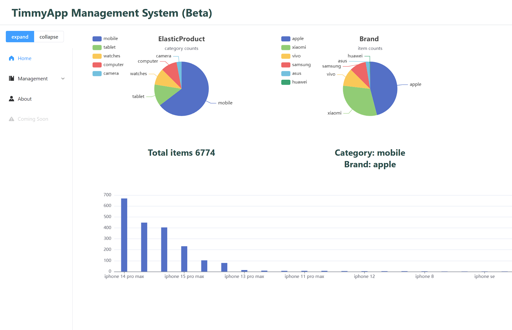
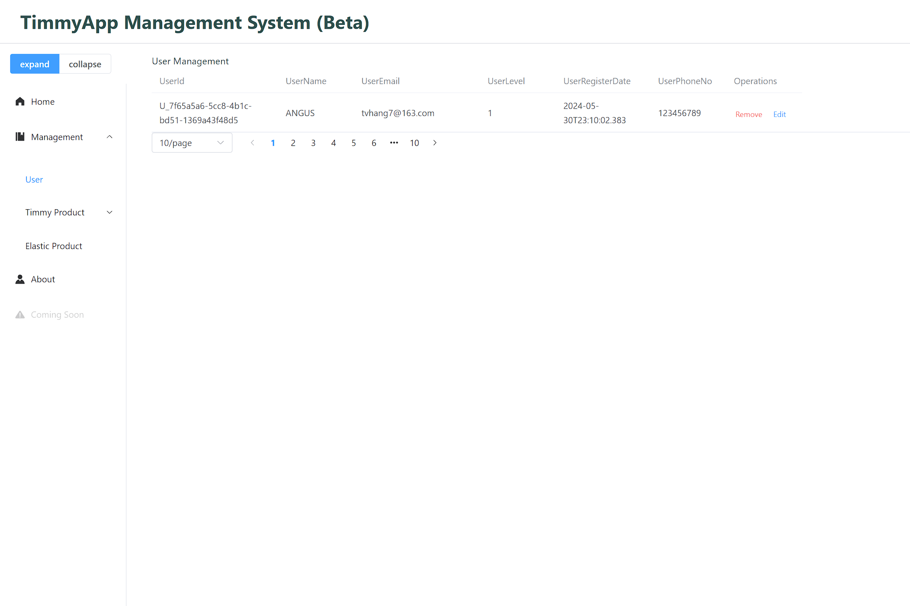
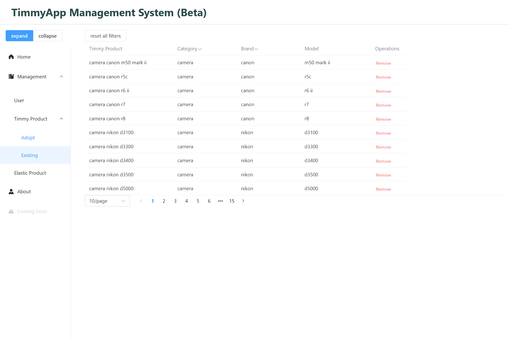

<link
  rel="stylesheet"
  href="https://cdn.jsdelivr.net/gh/dheereshagrwal/colored-icons@1.7.5/src/app/ci.min.css"
/>

# ReactNative_ASP.NetCore_FYP2024_TimmyApp

This repo houses an app built with React Native, Vue, ASP.NET Core WebAPI, Elastic Search, and Scrapy. React Native and Vue powers the front end, ASP.NET Core WebAPI handles backend services, Elastic Search provides robust search functionality, and Scrapy enables efficient web scraping.

---

## About this application

With the rapid development of the internet and artificial intelligence, the concept of green consumption has become increasingly ingrained in people's minds. Consumers are more willing to purchase second-hand goods, especially electronic products, due to the fast iteration cycle of these items, which leads to significant price drops for older models. However, finding the best prices for such products often requires checking multiple second-hand platforms, which can be time-consuming. This project designs an Android-based real-time price comparison system for second-hand goods, utilizing web scraping technology and a client-server architecture to achieve real-time price comparison across multiple data sources.
The main tasks and results of this paper are as follows:

1. Designed a subsystem based on the **Scrapy framework** for efficiently scraping second-hand product data and save the data to **ElasticSearch**. The system is designed to be extensible by allowing new data sources to be integrated into the system through the addition of parsing files, thus improving system scalability.
2. Applied a hybrid **TF-Cosine+LD** algorithm to classify the scraped data into correct product models, ensuring accurate product categorization. The algorithm's effectiveness was tested using real data.
3. Developed an **Android-based** real-time price comparison system for second-hand goods using the **React Native framework**. The paper first analyzed the system requirements and identified the necessary functionalities, including price comparison, product search, and product subscription. Based on this analysis, the client-server architecture was designed, implemented, and tested.

---

## Mobile Interface

  

    
Welcome page

    <image src = "./Assets/DemoGif/welcome.gif" height="300"/>
  

  

    
Login page

    <image src = "./Assets/DemoGif/login.gif" height="300"/>
  

  

    
Home page

    <image src = "./Assets/DemoGif/browse.gif" height="300"/>
  

  

    
Search page

    <image src = "./Assets/DemoGif/search.gif" height="300"/>
  

  

    
Favourite page

    <image src = "./Assets/DemoGif/fav.gif" height="300"/>
  

  

    
Subscribe page

    <image src = "./Assets/DemoGif/subscribe.gif" height="300"/>
  

  

    
Profile page

    <image src = "./Assets/DemoGif/profile.gif" height="300"/>
  

## Manager Interface

---

## Folders

### Assets

Stores images, icon etc for this repo.

### [ScrapyFYP](./ScrapyFYP/README.md) <- learn more

Stores all project-related codes, including server, react-native, elastic search, bloomfilter and scrapy.

---

## Tech Stack

### Frontend

| Tech        |                                                                     |
| ----------- | ------------------------------------------------------------------- |
| JavaScript  | <image src = "./Assets/TechStackIcon/JS.png" height="40"/>          |
| ReactNative | <image src = "./Assets/TechStackIcon/ReactNative.svg" height="40"/> |
| NativeWind  | <image src = "./Assets/TechStackIcon/TailWind.svg" height="40"/>    |
| Npm         | <image src = "./Assets/TechStackIcon/Npm.svg" height="40"/>         |
| Vue         | <image src = "./Assets/TechStackIcon/Vue.svg" height="40"/>         |

### Server

| Tech          |                                                                       |
| ------------- | --------------------------------------------------------------------- |
| C#            | <image src = "./Assets/TechStackIcon/CS.svg" height="40"/>            |
| Docker        | <image src = "./Assets/TechStackIcon/Docker.svg" height="40"/>        |
| SQL Server    | <image src = "./Assets/TechStackIcon/sqlserver.png" height="40"/>     |
| ElasticSearch | <image src = "./Assets/TechStackIcon/elasticsearch.svg" height="40"/> |
| Scrapy        | <image src = "./Assets/TechStackIcon/scrapy.png" height="40"/>        |
| Python        | <image src = "./Assets/TechStackIcon/Python.svg" height="40"/>        |

---

## How to use

---

## Project Timeline
2023/12 - Brief of this project "TimmyApp"
1. Project requirements - started to write down the requirement of this project.
2. Thesis reading - read several related article to get some idea on how to implement this project.

2024/2 -  Opening report
1. Scrapy - designed realtime scraper for multiple second-hand goods website
2. ASP .NET Core - built a server using WebApi
3. Elastic Search - setup an elastic search server using Docker

2024/4 - Mid term report
1. React Native - Developed mobile user interface
2. Vue.js - Developed manager interface
3. Item categorize algorithm - Optimized the item categorize algorithm using IDF + Cosine Similarity + Levenshtein-Distance

2024/6 - Final Thesis report

---
Built and designed by AngusTan 2024