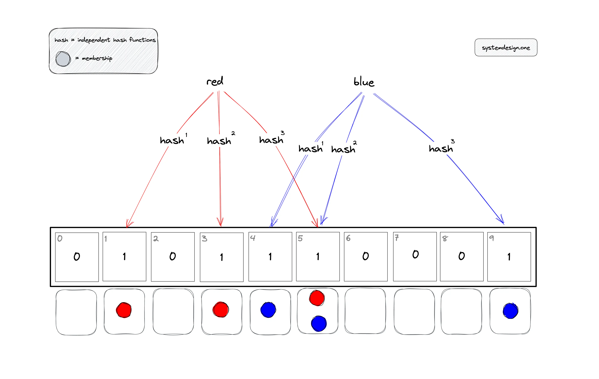

# Bloom filter

By using some hash function to map a string, store it into a filter, which is a hashmap
Choosing Hash Function - **improve distribution and reduce collisions**

---

### Bloom Filter API
#### init
init(capacity, error_rate)

#### add
add(element)

#### remove
remove(element)

#### contains
contains(element)

#### save to file
save_to_file(filename)

#### load from file
load_from_file(filename)

#### batch add
batch_add(filename)

---

### Choosing hash function for BloomFilter

MD5 (Message Digest Algorithm 5): Despite its cryptographic weaknesses, MD5 can still be suitable for non-security-critical applications like Bloom filters. It produces a 128-bit hash value, which may be truncated to fit the Bloom filter's bit array size.

SHA-1 (Secure Hash Algorithm 1): Similar to MD5, SHA-1 produces a fixed-size (160-bit) hash value. It's also suitable for non-security-critical applications but may be slower than MD5.

SHA-256 (Secure Hash Algorithm 256): SHA-256 produces a longer (256-bit) hash value and is more secure than MD5 or SHA-1. It may offer better distribution of hash values but may also be slower due to the larger output size.

MurmurHash: MurmurHash is a non-cryptographic hash function designed for speed and good distribution properties. It's often used in applications where performance is critical, such as Bloom filters.

CityHash: Similar to MurmurHash, CityHash is optimized for speed and good distribution. It's particularly efficient for hashing short strings like URLs.

---

### 布隆过滤器的空间大小计算 
通过设置预计数据大小以及容错率来计算出需要用到的空间

布隆过滤器中的比特数组大小根据两个主要参数计算：布隆过滤器的预期容量（`capacity`）和期望的错误率（`error_rate`）。比特数组的大小（`m`）使用以下公式确定：

\[ m = -\frac{{n \times \ln(p)}}{{(\ln(2))^2}} \]

其中：
- \( m \) 是比特数组的大小（位数）。
- \( n \) 是布隆过滤器的预期容量（要存储的元素数量）。
- \( p \) 是期望的错误率（误判为正的概率）。

该公式是从布隆过滤器中最优数量的哈希函数的方程推导而来，该方程为：

\[ k = \frac{{m}}{{n}} \ln(2) \]

在实践中，\( m \) 被舍入到最接近的整数，以确保比特数组大小足以达到期望的错误率。

比特数组的大小决定了用于表示布隆过滤器中元素的位数。较大的比特数组可以容纳更多的元素并减少误判为正的概率，但需要更多的内存。相反，较小的比特数组节省内存但可能增加误判为正的可能性。

通过调整参数 `capacity` 和 `error_rate`，您可以控制比特数组的大小，并优化布隆过滤器的性能，以满足您特定的应用需求。

---

### If want to delete item from bloom filter
1. Counting Bloom Filter:
Counting Bloom Filter 在普通的布隆过滤器的基础上，每个位不再只是一个二进制值，而是一个计数器。当元素被加入时，相关的位被增加；当元素需要被删除时，相关的位被减少。因此，Counting Bloom Filter 允许删除操作，但需要额外的空间来存储计数器。

2. Scalable Bloom Filter:
Scalable Bloom Filter 允许动态地调整布隆过滤器的大小，以适应数据的增长或减少。它可以根据需要动态地增加或减少哈希函数的数量，从而改变过滤器的容量。这使得它可以在不重新构建过滤器的情况下实现元素的删除操作。

测试利用了1.是可以的，现在要做的就是批量处理很多数据，查看百分比区别

### 疑问 ：误判为正
>布隆过滤器
可能误判不在里面的为正 False Correct
不会误判为负，有的话一定会有，因为位置肯定占在里面了。

所以需要提高空间以及进行哈希的次数。

### 测试环节

测试数据量`100000`的序列里面的误判率。
- 即是不存在在里面的却说在里面。

数据集：获取mudah里的著名商品包括iphone12至15，华为mate20至50，小米8至12，总数`N`
测试数据：查找iphone，查看利用普通程序与以上数据集比较有相同的数目`m`，再利用布隆过滤器比较`n`，找出差异

若`m/N`与`n/N`的差异小于`1%`即可。

Same item count using bloom `n` - 43
Same item count in actual files `m` - 43
Total item in bloom filter `N` - 3531

**经过测试，可以发现效果是好的。**

---
Built and designed by AngusTan 2024