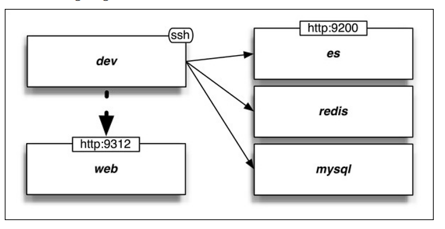
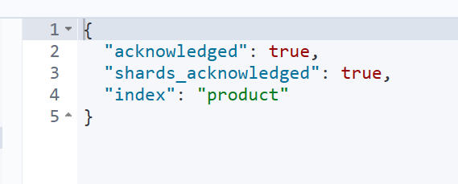
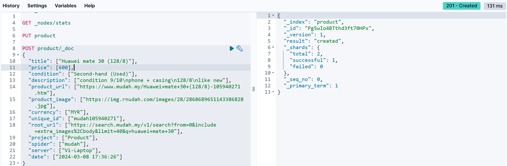
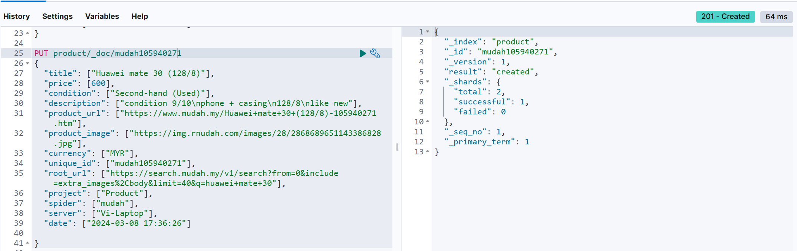
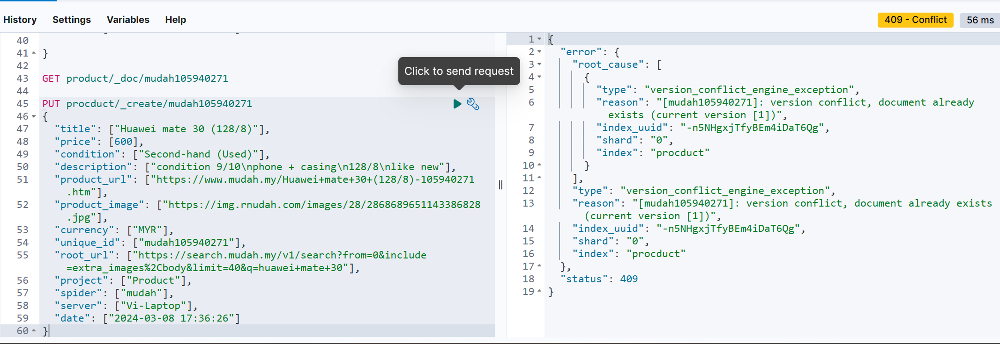

<h1 style="color:#6895D2">Elastic Search</h1>

---

<h3 style="color:#B0C4DE">Steps</h3>

| 任务             | 怎么                                                   | 时间      |
| ---------------- | ------------------------------------------------------ | --------- |
| 链接Scrapy       | https和cert，但是不知道为什么cmd不能跑，Python程序可以 | 2024/3/10 |
| 建立倒排索引     | 自己会执行的                                           | 2024/3/12 |
| 尝试搜索         | 搜索成功                                               | 2024/3/12 |
| 尝试以价格排序   | 可以成功                                               | 2024/3/13 |
| 尝试后续添加物品 |                                                        |           |


<h3 style="color:#B0C4DE">配置ElasticSearch和Kibana</h3>


通过REST API链接

利用`treq`包，与Python得`requests`一样但是是给Twisted-based程序。
- 再性能上比Scrapy得Request好。

https://www.elastic.co/guide/en/elasticsearch/reference/current/docker.html

<h4 style="color:#CC5522">创建用户</h4>

usr/share/elasticsearch/config/roles.yml
```yml
# The default roles file is empty as the preferred method of defining roles is
# through the API/UI. File based roles are useful in error scenarios when the
# API based roles may not be available.
admins:
  cluster:
    - all
  indices:
    - names:
        - "*"
      privileges:
        - all
devs:
  cluster:
    - manage
  indices:
    - names:
        - "*"
      privileges:
        - write
        - delete
        - create_index
```

到elasticsearch目录下
```bash
elasticsearch-users useradd <username> -p <password> -r <roles>
```

username: angus
pwd: youknow

<h4 style="color:#CC772C">下载ik分词器</h4>

https://github.com/infinilabs/analysis-ik/releases/tag/v8.12.0
https://www.jianshu.com/p/0a9d675d48f7

<h4 style="color:#E27D5E">链接Kibana</h4>

https://www.elastic.co/guide/en/kibana/current/docker.html


<h4 style="color:#CC5522">通过本机连接</h4>

跳过证书得方法
`curl -k -u elastic:6gCqElpEIxnENzt5tT3U https://localhost:9200`


<h3 style="color:#B0C4DE">链接Scrapy</h3>

>curl --ssl-no-revoke --cacert http_ca.crt -u elastic:6gCqElpEIxnENzt5tT3U https://localhost:9200

>curl --proxy-cacert http_ca.crt -u elastic:6gCqElpEIxnENzt5tT3U https://localhost:9200

<h4 style="color:#CC5522">经过几番折腾，再python程序里可以通过cert验证通过了？</h4>

```python
from elasticsearch import Elasticsearch

scheme = "https://"
host = 'localhost'
port = 9200
username = 'elastic'
password = '6gCqElpEIxnENzt5tT3U'


# Create Elasticsearch client instance
es = Elasticsearch(
    hosts=f"https://localhost:9200/",
    basic_auth=(username, password),
    verify_certs=True,  # Disable SSL certificate verification
    ca_certs="http_ca.crt"
)

response = es.info()

print(response)
```


<h3 style="color:#B0C4DE">Kibana CRUD 操作</h3>

<h4 style="color:#CC772C">Create Index</h4>

```
PUT nameofindex
```



<h4 style="color:#E27D5E">Create a document</h4>

POST - will autogenerate an id for document
PUT - with specific id, maybe can use it like this
`PUT product/_doc/{unique_id}`
**并且，PUT会属于更新数据**

```
POST nameofindex/_doc
{
  "field":"value"
}


PUT nameofindex/_dov/1
{
  "field": "value"
}


```

**POST**

**PUT**


<h4 style="color:#CC5522">Index a document</h4>

GET

```
GET nameofindex/_doc/id
```

<h4 style="color:#CC772C">_create</h4>

_create endpoint will look for conflict

```
PUT nameofindex/_create/id
{


}
```




<h4 style="color:#E27D5E">Update</h4>

```
POST nameofindex/_update/id
{
  "doc":{
    "field1": "value"
  }
}
```

<h4 style="color:#CC5522">Delete</h4>

```
DELETE nameofindex/_doc/id
```

<h3 style="color:#B0C4DE">创建Product Index（包含其数据结构，以及是否需要建立索引）</h3>

Look at the folder ElasticSearch for more.

---
color used in this template:
Olive Green (#6895D2): A deep, mossy green like a forest floor.
Powder blue (#B0C4DE): A soft and calming shade of blue.
Burnt orange (#CC5522): A rich and earthy color that adds warmth and dept
Terracotta (#E27D5E)
Ochre (#CC772C)