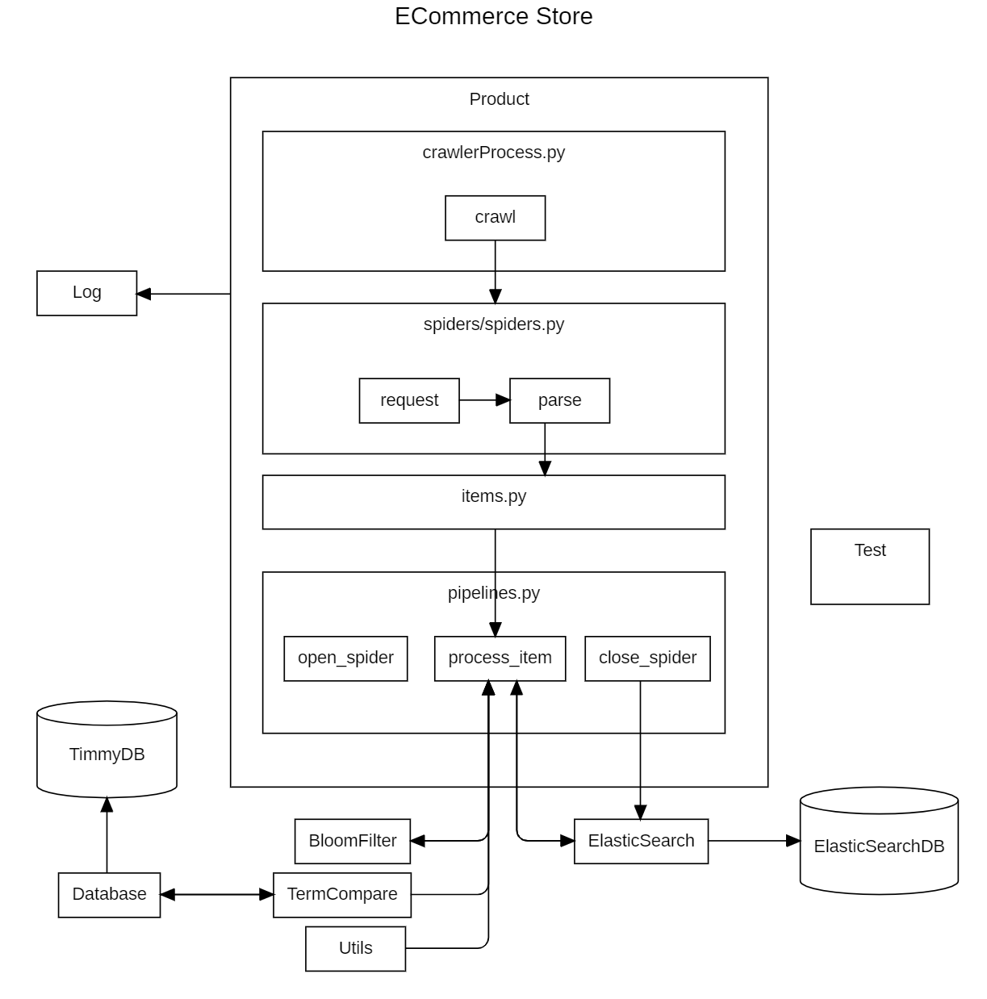

# ECOMMERCE STORE

Holds the codebase for the Scrapy module, responsible for scraping product from web.

---

# Folders

## Product
### BloomFilter
Contains the implementation of Bloom Filter for efficient data filtering with using *python*.

### Database
Contains the implementation of connecting *TimmyDatabase* for accessing database using *python*.

### ElasticSearch
Contains the implementation of Accesing ElasticSearch for data storing after scraping using *python*.

### Log
Contains the scraping log file

### Product
Contains the implementation of Scrapy for scraping items from web using *python*.

### TermCompare
Contains the implementation of Term Comparison for effectively filtering product model using *python*.

### Test
Contains the test file for Ecommerce Store module.

### Utils
Some utilies file.

---

# Framework

The process of the Ecommerce store crawling is shown below
1. User will use api provided by `crawlerProcess.py` to start the scraping process
2. The crawling process included requesting, parsing, process_item and close spider.
3. In the process_item, it's crucial because it will filter out duplicate product, generalize the product information and correctly categorize the product model, brand.
4. After the crawling process is done, it will index all the crawled and cleaned data to elastic search.



---

# How to use
## Setup configuration file
`/Product/config.ini`
```ini
[Database]
self.server = # your server
self.database = # your database
self.driver = # responding driver
self.tableName = # Product table name
self.ProductFullName = # Product table fullname
self.ProductCategory = # Product table category
self.ProductBrand = # Product table brand
self.ProductModel = # Product table model
self.ProductSubModel = # Product table sub model
self.ProductAdopted = # Product table adopted

[ElasticSearch]
self.scheme = "https://"
self.host = 'localhost'
self.port = 9200
self.username = 'elastic'
self.password = # your password
self.index = # your index
```

## Database Scheme to correctly fetch the category brand

**TableName** 
| Name            | Type   | Example                    |
| --------------- | ------ | -------------------------- |
| ProductFullName | string | mobile apple iphone 15 pro |
| ProductCategory | string | mobile                     |
| ProductBrand    | string | apple                      |
| ProductModel    | string | iphone 15 pro              |
| ProductSubModel | string | apple                      |
| ProductAdopted  | int    | 1                          |

## Run the script
```bash
python .\Product\crawlerProcess.py -c mobile -b apple -m iphone 15 pro max -s mudah aihuishou -t 1 -i 10

-c Category
-b Brand
-m Model
-s Spider to use
-t isTest
-i iteration

```

## Check the output
Check the log file for responding datetime that you start scraping in `\Log\.log`


---