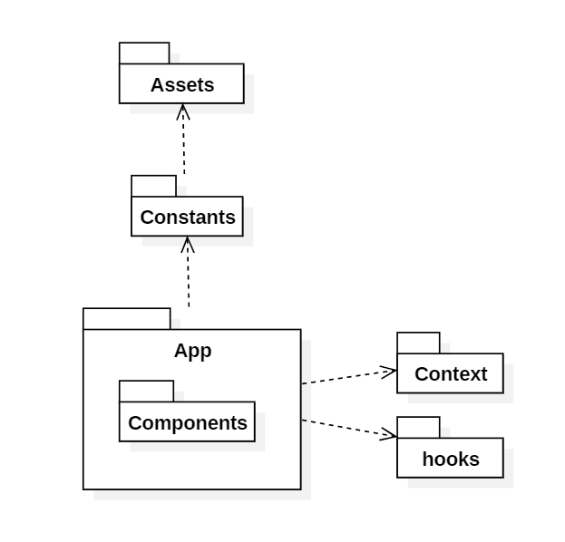

# Mobile

---
# Installation
https://docs.expo.dev/router/installation/
https://www.nativewind.dev/quick-starts/expo
- also setup for react native web
- use *NativeWind* to do styling
- use *react-native-reanimated* for animation

---

# Folders

## app
Contains the pages in the application for example: home, profile page etc.

## assets
Contains icons, images, font for the application

## components
Often used components like buttons, selector, header, footer stored in here.

## constants
Store the assets path, to use it easily in app and components

## context
A folder that store global state, for example, user info after logging in

## hooks
Custom react native hook like fetching api

## test
A folder that contain test code during development state

---
Built and designed by AngusTan 2024