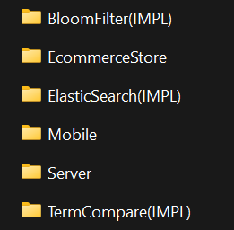

# TimmyApp FYP Repository
---
## Folders

### Server
Hosts the ASP.NET Core WebAPI server code, providing backend services and handling client-server communication.

- GOTO [ServerMD](./Server/README.md) to read specific Documentation

### EcommerceStore
Holds the codebase for the Scrapy module, responsible for scraping product from web.

- GOTO [EcommerceStoreMD](./EcommerceStore/README.md) to read specific Documentation

#### BloomFilter（IMPL）
**IMPL** - Means that it is used to do testing, there should be a copy inside EcommerceStore, as it utilize this package

Contains the implementation of Bloom Filter for efficient data filtering.
- GOTO [BloomFilterMD](./BloomFilter(IMPL)/README.md) to read specific Documentation

#### ElasticSearch（IMPL）
**IMPL** - Means that it is used to do testing, there should be a copy inside EcommerceStore, as it utilize this package

Includes configurations and scripts for integrating and managing ElasticSearch for powerful search functionality within the application.

- GOTO [ElasticSearchMD](./ElasticSearch(IMPL)/README.md) to read specific Documentation

#### TermCompare (IMPL)
**IMPL** - Means that it is used to do testing, there should be a copy inside EcommerceStore, as it utilize this package

Stores scripts and resources for term comparison analysis within the application.

- GOTO [TermCompareMD](./TermCompare(IMPL)/README.md) to read specific Documentation

### Mobile
Contains the React Native codebase for the mobile application, enabling cross-platform development for Android and iOS devices.

- GOTO [Mobile.md](./Mobile/README.md) to read specific Documentation

---
Built and designed by AngusTan 2024