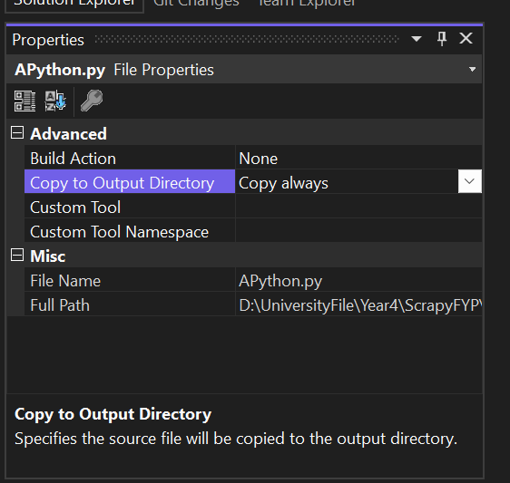
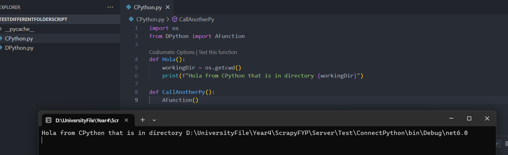

# C# server

| Task                               | About                                       | Date      |
| ---------------------------------- | ------------------------------------------- | --------- |
| Demo executing python script in C# | learn how it works to call another language | 2024/3/14 |
| Create .Net server                 | the server                                  | 2024/3/14 |
| Create Frontend                    | the view |           |

---

# Demo executing python script in C#
### setting up for pythonnet
1. 连接python *dll*
   1. 它提供了Python和 C#（或其它语言）之间的桥梁
   2. dll里面包含了python运行时环境，基本模块

```cs
//连接dll
Runtime.PythonDLL = "C:\\Users\\tvh10\\AppData\\Local\\Programs\\Python\\Python310\\Python310.dll";
PythonEngine.Initialize();

//create lock
using (Py.GIL())
{
    var pythonScript = Py.Import("APython");
    //pythonScript.InvokeMethod("printHello");

    var messageToPython = new PyString("It's from C# that get converted through PyString!");
    pythonScript.InvokeMethod("printSomething", new PyObject[] {messageToPython});
}
```

### running a python script that contains another python script

都得使用到这个属性**Copy to Output Directory**


>on solution explorer, right click on your python file - > Properties - >copy to Output Directory to "Copy Always"
That way when you build solution your python file will be included

这样子该文件才可以在运行时被包含在内，像是md这些文件可以去掉，因为不需要使用。

### running script that is in another folder



- 只需要通过在Import的时候将整个文件夹添加进入Python运行时就可以运行了

```cs
static void RunScript2(string scriptName)
{
	Runtime.PythonDLL = "C:\\Users\\tvh10\\AppData\\Local\\Programs\\Python\\Python310\\Python310.dll";
	PythonEngine.Initialize();

	using (Py.GIL())
	{
		//adding the path to this project
		string pythonProjectPath = "D:\\UniversityFile\\Year4\\ScrapyFYP\\Server\\TestDifferentFolderScript";

		dynamic sys = Py.Import("sys");
		sys.path.append(pythonProjectPath);

		using (Py.GIL())
		{
			var pythonScript = Py.Import("CPython");
			pythonScript.InvokeMethod("CallAnotherPy");
		}

	}
}
```

## Lastly used execute script to complete
- use Process to run the python script
- it's important to let the process know where is the working directory to import the packages correctly
- now it can output succeed if the execution is good.
- try to do it if it fails

---

# .NET Server
for full documentation check out `README.md` in *TimmyAppServer* folder