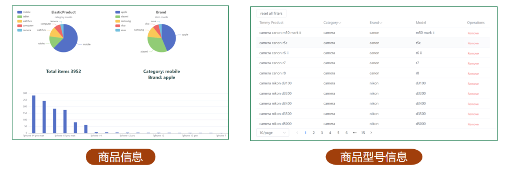

# C# server
---
# Folders
## webapi


1. Controllers - 控制层
2. DAO - 模型层
3. Models - 模型类
4. Product - [EcommerceStore](../EcommerceStore/README.md)
5. Services - 业务层
6. Utilities - 其他功能


## vueapp




---

## Some notes
### 1 Create Server
https://learn.microsoft.com/en-us/visualstudio/javascript/tutorial-asp-net-core-with-vue?view=vs-2022
因为现在用的是ES javascript，模块化的，再导入的时候运行出错就去相应的文件修改就可以了，修改成这样


### 2 将Model移动进入C#
```cmd
dotnet ef dbcontext scaffold "Data Source=(localdb)\localDB1;Initial Catalog=TimmyDB;Integrated Security=True" Microsoft.EntityFrameworkCore.SqlServer --output-dir Models --context TimmyDbContext --no-build -f
```

### 3 将ElasticSearch移入C#里面
一整个过程比较煎熬，因为文档页好乱，可是最后可以成功了，备份好了
https://www.elastic.co/guide/en/elasticsearch/client/net-api/7.17/writing-queries.html

### Demo executing python script in C#
#### setting up for pythonnet
1. 连接python *dll*
   1. 它提供了Python和 C#（或其它语言）之间的桥梁
   2. dll里面包含了python运行时环境，基本模块

```cs
//连接dll
Runtime.PythonDLL = "C:\\Users\\tvh10\\AppData\\Local\\Programs\\Python\\Python310\\Python310.dll";
PythonEngine.Initialize();

//create lock
using (Py.GIL())
{
    var pythonScript = Py.Import("APython");
    //pythonScript.InvokeMethod("printHello");

    var messageToPython = new PyString("It's from C# that get converted through PyString!");
    pythonScript.InvokeMethod("printSomething", new PyObject[] {messageToPython});
}
```

#### running a python script that contains another python script

都得使用到这个属性**Copy to Output Directory**


>on solution explorer, right click on your python file - > Properties - >copy to Output Directory to "Copy Always"
That way when you build solution your python file will be included

这样子该文件才可以在运行时被包含在内，像是md这些文件可以去掉，因为不需要使用。

#### running script that is in another folder


- 只需要通过在Import的时候将整个文件夹添加进入Python运行时就可以运行了

```cs
static void RunScript2(string scriptName)
{
	Runtime.PythonDLL = "C:\\Users\\tvh10\\AppData\\Local\\Programs\\Python\\Python310\\Python310.dll";
	PythonEngine.Initialize();

	using (Py.GIL())
	{
		//adding the path to this project
		string pythonProjectPath = "D:\\UniversityFile\\Year4\\ScrapyFYP\\Server\\TestDifferentFolderScript";

		dynamic sys = Py.Import("sys");
		sys.path.append(pythonProjectPath);

		using (Py.GIL())
		{
			var pythonScript = Py.Import("CPython");
			pythonScript.InvokeMethod("CallAnotherPy");
		}

	}
}
```

## Lastly used execute script to complete
- use Process to run the python script
- it's important to let the process know where is the working directory to import the packages correctly
- now it can output succeed if the execution is good.
- try to do it if it fails

---
Built and designed by AngusTan 2024