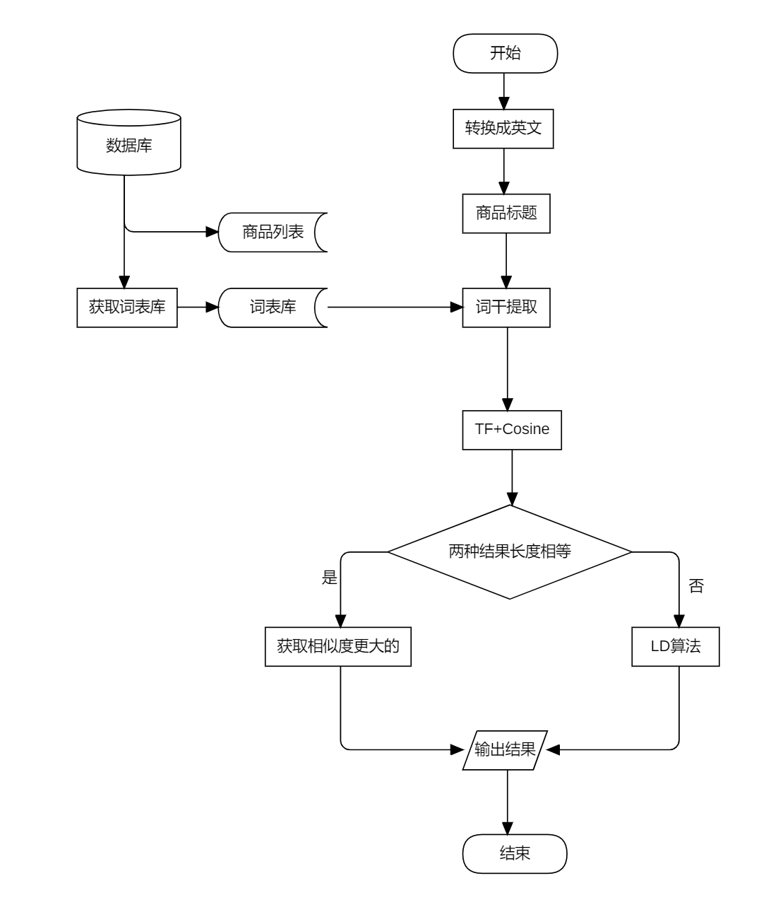
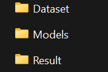

# TermCompare

## ScrapyTermCompare (Main implementation)


### LanguageConverter
This python file includes the function to interchange the language from
1. any language -> english
2. english -> corresponding language

With two important functions, `convertToCorrespondingPlatformLanguage` and `convertToEnglish`.

It initialized with parameter __init__(self,category,brand,spider), read from `ProductNameConvert.json` to works.

### ProductNameConvert（json）
```json
{
    "platform":{
        "aihuishou":"chinese",
        "mudah":"english"
    },
    "mobile":{
        "apple":{
            "english":["apple"],
            "chinese":["苹果"]
        },
        "xiaomi":{
            "english":["xiaomi", "redmi"],
            "chinese":["小米", "红米"]
        },
        ...
    },
    "camera":{
        "canon":{
            "english":["canon"],
            "chinese":["佳能"]
        },
        "nikon":{
            "brand":"尼康",
            "english":["nikon"],
            "chinese":["尼康"]
        },
        "olympus":{
            "english":["olympus"],
            "chinese":["奥林巴森"]
        }
    }
    ,...
}
```

### TimmyDatabase

## GetTitle（Test python）
This python file is used to test the **ScrapyTermCompare** Function.
Input - `GetTitle(Models, Dataset, Output, Category, Brand, Platform)`



Dataset - scraped product json data from `Mudah.my`
Models - hand-coded models for every brand in json (In real implementation used Database to store)
Output - the output folder

Result -
```json
{
  "count": 188,
  "correct": 181,
  "executedTime": 0.40004634857177734,
  "data": [
    {
      "title": "Apple IPhone 15 Pro Sealed",
      "trimmedTitle": "iphone 15 pro",
      "predictedModel": "iphone 15 pro",
      "realModel": "iphone 15 pro",
      "category": "mobile",
      "distance": 1.0000000000000002,
      "correct": true
    },
    {
      "title": "APPLE WATCH S7-41M- Untuk dilepaskan",
      "trimmedTitle": "watch 7",
      "predictedModel": "watch 7",
      "realModel": "watch 7",
      "category": "watches",
      "distance": 1.0,
      "correct": true
    },
    {
      "title": "Apple watch series 8 45mm cellular",
      "trimmedTitle": "watch 8",
      "predictedModel": "watch 8",
      "realModel": "watch 8",
      "category": "watches",
      "distance": 1.0,
      "correct": true
    },
    ...
}
```
---
Built and designed by AngusTan 2024